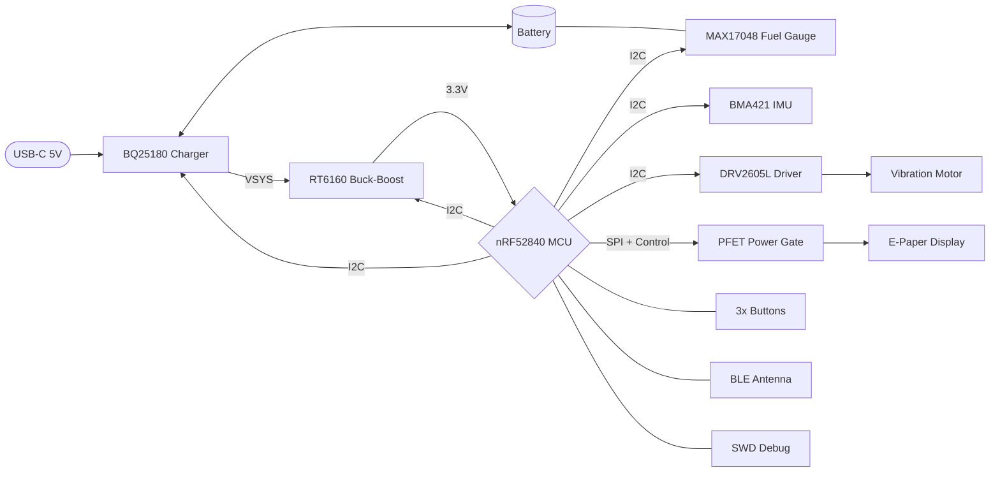

# InkTime

**Author:** David Stancu

This repository contains the files for the InkTime smartwatch, powered by the nRF52840 microcontroller, specialized in efficient module interaction.

---

## Block Diagram



---

### Microcontroller — nRF52840

- Main processing unit that runs the firmware and controls all system behavior  
- Includes built in wireless communication and USB support  
- Uses external timing sources for stable operation and low power timekeeping  
- Connected to a PCB antenna for wireless communication  

### Display — 1.54 E-Paper (SPI)

- Uses a small set of control signals for data and command handling  
- Connected through a fine pitch display connector  
- Power to the display is switched off between updates to save energy  
- Refreshes periodically to update the watch face  

### IMU — BMA421 (I2C)

- Detects motion and user activity using an internal sensor  
- Can generate interrupt signals to wake the system when movement is detected  
- Placed to minimize interference from other components  

### Haptics — DRV2605L (I2C)

- Drives a vibration motor to provide user feedback  
- Can play predefined feedback patterns  
- Fully powered down when not in use to reduce consumption  

### Power Management — BQ25180 + MAX17048 + RT6160

- Handles battery charging and power distribution across the system  
- Maintains a stable supply voltage during operation  
- Monitors battery level without requiring additional sensing components  

### Inputs — Buttons

- Provide user input through simple tactile switches  
- Configured to wake the system from low power states  

### Shared I2C Bus

- Connects multiple peripherals over a shared communication interface  
- Uses pull up resistors to maintain signal integrity  
- Managed by a single controller instance  

### Debug — Tag-Connect TC2030

- Provides access for programming and debugging  
- Ensures the device can be recovered even if firmware issues occur  

---

## nRF52840 Pin Mapping

| Pin | Signal | Connected to | Reason |
|-----|--------|--------------|--------|
| P0.02 | EPD_SCK | E-Paper Display | SPI clock |
| P0.03 | EPD_MOSI | E-Paper Display | SPI data out |
| P0.05 | EPD_CS | E-Paper Display | Dedicated chip select |
| P0.06 | I2C_SDA | Charger, Regulator, Fuel Gauge, IMU, Haptic | Shared low-speed bus |
| P0.07 | I2C_SCL | Charger, Regulator, Fuel Gauge, IMU, Haptic | Shared low-speed bus |
| P0.08 | IMU_INT1 | BMA421 | Primary wake/step interrupt |
| P0.11 | PMIC_INT | BQ25180 | Charger fault/status interrupt |
| P0.12 | HAPTIC_EN | DRV2605L | Full haptic shutdown between events |
| P0.13 | BTN_UP | Button Up | Active-low user input, wake from sleep |
| P0.14 | BTN_DN | Button Down | Active-low user input, wake from sleep |
| P0.15 | EPD_DC | E-Paper Display | Data / command select |
| P0.16 | EPD_RST | E-Paper Display | Hardware reset |
| P0.17 | EPD_BUSY | E-Paper Display | Busy feedback |
| P0.18 | RESET | — | System reset |
| P1.00 | BTN_ENT | Button Enter | Active-low user input, wake from sleep |
| P1.01 | EPD_PWR_GATE | PFET gate | Enables VEPD power gating |
| P1.08 | IMU_INT2 | BMA421 | Secondary interrupt / debug |
| P1.10 | ALERT | MAX17048 | Under/over-voltage alert |
| USBDP | USB_D+ | USB-C / ESD | Native USB data+ |
| USBDM | USB_D- | USB-C / ESD | Native USB data- |
| XL1/XL2 | — | 32.768 kHz crystal | RTC / low-power timekeeping |
| XC1/XC2 | — | 32 MHz crystal | Main radio/CPU clock |
| SWDCLK | SWDCLK | TC2030 | SWD programming clock |
| SWDIO | SWDIO | TC2030 | SWD programming data |
| ANT | RF | 2.4 GHz antenna | BLE antenna feed |

---

## Bill of Materials


| Part Name | Qty | Function | Link |
|:----------|:---:|:---------|:-----|
| NRF52840-QIAA-R7 | 1 | MCU (BLE + USB) | [Link](https://jlcpcb.com/partdetail/NordicSemicon-NRF52840_QIAAR7/C1851953) |
| BQ25180YBGR | 1 | Li-ion charger / power path | [Link](https://jlcpcb.com/partdetail/TexasInstruments-BQ25180YBGR/C3682423) |
| RT6160AWSC | 1 | Buck-boost 3.3V regulator | [Link](https://jlcpcb.com/partdetail/RichtekTech-RT6160AWSC/C7065276) |
| MAX17048G+T10 | 1 | Fuel gauge (ModelGauge) | [Link](https://jlcpcb.com/partdetail/2777647-MAX17048GT10/C2682616) |
| BMA421 | 1 | 3-axis IMU + step counter | [Link](https://jlcpcb.com/partdetail/BoschSensortec-BMA421/C5242966) |
| DRV2605YZFR | 1 | Haptic driver (LRA/ERM) | [Link](https://jlcpcb.com/partdetail/TexasInstruments-DRV2605YZFR/C81079) |
| USBLC6-2SC6Y | 1 | USB ESD protection | [Link](https://jlcpcb.com/partdetail/TECHPUBLIC-USBLC62SC6Y/C5310974) |
| KH-TYPE-C-16P | 1 | USB-C connector (16P) | [Link](https://jlcpcb.com/partdetail/Shenzhen_KinghelmElec-KH_TYPE_C16P/C709357) |
| 5034802400 | 1 | 24-pin 0.5mm FPC connector (e-paper) | [Link](https://jlcpcb.com/partdetail/MOLEX-5034802400/C122434) |
| 2450AT18B100E | 1 | 2.4 GHz chip antenna | [Link](https://jlcpcb.com/partdetail/JohansonDielectrics-2450AT18B100E/C2917717) |
| SI1308EDL-T1-GE3 | 1 | E-paper power gate PFET | [Link](https://jlcpcb.com/partdetail/VishayIntertech-SI1308EDL_T1GE3/C469327) |
| DMG2305UX-7 | 1 | PFET (power path) | [Link](https://jlcpcb.com/partdetail/DiodesIncorporated-DMG2305UX7/C150470) |
| NX2016SA-32MHZ-STD-CZS-5 | 1 | 32 MHz HF crystal | [Link](https://jlcpcb.com/partdetail/NDK-NX2016SA_32MHZ_STD_CZS5/C843260) |
| CM8V-T1A-32.768KHZ-9PF-20PPM | 1 | 32.768 kHz LF crystal (RTC) | [Link](https://jlcpcb.com/partdetail/C5366546) |
| EVPAKE31A | 3 | SMD tactile buttons | [Link](https://jlcpcb.com/partdetail/PANASONIC-EVPAKE31A/C569760) |
| MBR0530 | 3 | Schottky diodes | [Link](https://jlcpcb.com/partdetail/78464-MBR0530/C77336) |
| FTC252012SR47MBCA | 1 | Ferrite bead (power filter) | [Link](https://jlcpcb.com/partdetail/6763488-FTC252012SR47MBCA/C5832368) |
| 744043680 | 1 | Inductor (buck-boost) | [Link](https://jlcpcb.com/partdetail/WurthElektronik-744043680/C2045671) |
| SDFL1608S100KTF | 1 | Inductor (RF matching) | [Link](https://jlcpcb.com/partdetail/Sunlord-SDFL1608S100KTF/C1035) |
| UCR006YVPFLR470 | 1 | 0.47Ω sense resistor | [Link](https://jlcpcb.com/partdetail/ROHMSemicon-UCR006YVPFLR470/C2089071) |
| CPF0201D10KC1 | 6 | 10kΩ resistors 0201 | [Link](https://jlcpcb.com/partdetail/TEConnectivity-CPF0201D10KC1/C4187156) |
| 0201WMJ0332TEE | 2 | 3.3kΩ resistors 0201 | [Link](https://jlcpcb.com/partdetail/259848-0201WMJ0332TEE/C270318) |
| CR0201FH5101G | 2 | 5.1kΩ resistors 0201 (CC lines) | [Link](https://jlcpcb.com/partdetail/LIZElec-CR0201FH5101G/C100142) |
| 0201WMF220KTEE | 1 | 22Ω resistor 0201 | [Link](https://jlcpcb.com/partdetail/479910-0201WMF220KTEE/C473517) |
| GRM155R61H105KE05D | 9 | 1µF cap 0402 | [Link](https://jlcpcb.com/partdetail/1609005-GRM155R61H105KE05D/C1518208) |
| CL05A106MQ5NUNC | 3 | 10µF cap 0402 | [Link](https://jlcpcb.com/partdetail/16204-CL05A106MQ5NUNC/C15525) |
| GRM155R60J226ME11D | 2 | 22µF cap 0402 | [Link](https://jlcpcb.com/partdetail/408393-GRM155R60J226ME11D/C415703) |
| CGA0402X5R475M250GT | 1 | 4.7µF cap 0402 | [Link](https://jlcpcb.com/partdetail/HRE-CGA0402X5R475M250GT/C6119795) |
| GRM033R61A104KE15D | 5 | 100nF cap 0201 | [Link](https://jlcpcb.com/partdetail/MurataElectronics-GRM033R61A104KE15D/C76934) |
| CL05A475MP5NRNC | 5 | 4.7µF cap 0402 | [Link](https://jlcpcb.com/partdetail/24469-CL05A475MP5NRNC/C23733) |
| CL05A105KA5NQNC | 6 | 1µF cap 0402 | [Link](https://jlcpcb.com/partdetail/53938-CL05A105KA5NQNC/C52923) |
| 0201X104K100NT | 5 | 100nF cap 0201 | [Link](https://jlcpcb.com/partdetail/270391-0201X104K100NT/C284966) |
| CC0201KRX5R7BB473 | 1 | 47nF cap 0201 | [Link](https://jlcpcb.com/partdetail/YAGEO-CC0201KRX5R7BB473/C505465) |
| GRM0335C1H1R0BA01D | 2 | 1pF cap 0201 (RF matching) | [Link](https://jlcpcb.com/partdetail/MurataElectronics-GRM0335C1H1R0BA01D/C85893) |
| GRM0335C1H101JA01D | 1 | 100pF cap 0201 | [Link](https://jlcpcb.com/partdetail/MurataElectronics-GRM0335C1H101JA01D/C76922) |
| 0201CG120J500NT | 4 | 12pF cap 0201 (crystals) | [Link](https://jlcpcb.com/partdetail/51400-0201CG120J500NT/C50391) |
| SDCL1005C15NJTDF | 1 | 15nH inductor 0402 (RF) | [Link](https://jlcpcb.com/partdetail/Sunlord-SDCL1005C15NJTDF/C27143) |
| SDCL1005C3N9STDF | 1 | 3.9nH inductor 0402 (RF) | [Link](https://jlcpcb.com/partdetail/Sunlord-SDCL1005C3N9STDF/C14033) |
| 0201WMJ0000TEE | 3 | 0Ω jumper 0201 | [Link](https://jlcpcb.com/partdetail/259867-0201WMJ0000TEE/C270337) |

---

## 3D Assembly

The Fusion 360 assembly integrates the PCB (with all components), the  e-paper display module, the LiPo battery , the coin vibration motor, and the case — both as a closed assembly and in exploded view. 3D models of the battery, display, and motor were drawn from their datasheet mechanical dimensions.

---

## Repository Structure

```
|-- Hardware/
|    |-- InkTime.fbrd
|    |-- Inktime.fsch
|
|-- Manufacturing/
|    |-- GerberFiles.zip
|    |-- InkTime_bom.xlsx
|    |-- PnP_InkTime_front.csv
|
|-- Mechanical/
|    |-- InktimeFinal.f3z 
|    |-- Inktime_Exploded.f3z 
|
|-- Images/
|    |-- 2D_PCB.png
|    |-- 3D_product.png
|    |-- Inktime_exploded.png
|    |-- Inktime_3D_PCB.png
|
|-- LICENSE
|-- README.md
```

---